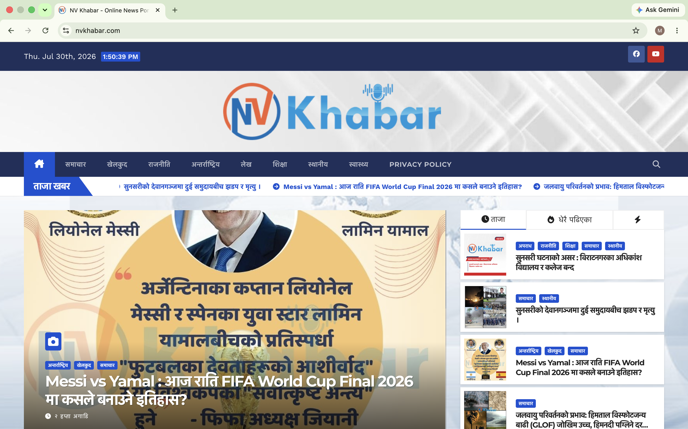
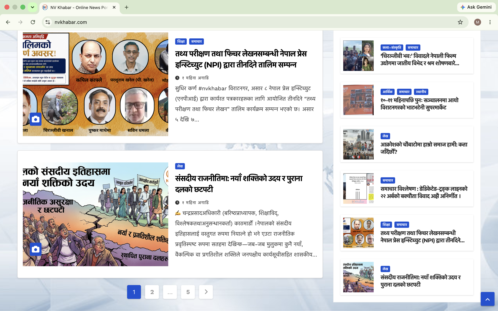
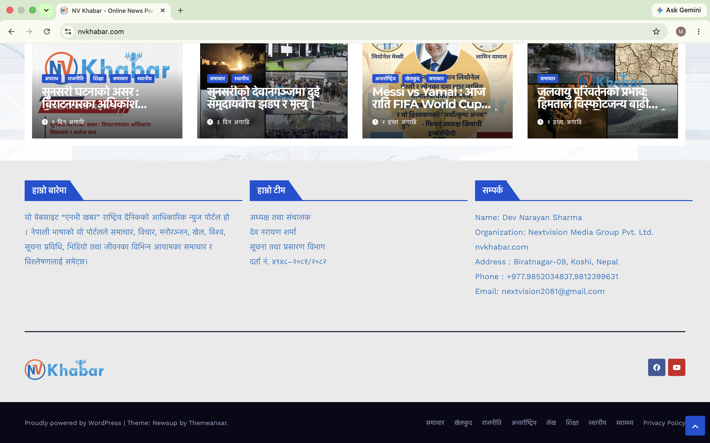

# NV Khabar - WordPress News Portal

## Overview

NV Khabar is a modern and responsive news portal developed using WordPress with a premium ready-made theme. The website delivers news across multiple categories with a clean, mobile-friendly, and SEO-optimized interface.

## My Role

* WordPress Installation & Configuration
* Theme Setup & Customization
* Plugin Installation & Configuration
* Homepage Design & Layout Customization
* Category & Menu Management
* SEO Optimization
* Performance Optimization
* Responsive Design

## Technologies Used

* WordPress
* PHP
* HTML
* CSS
* JavaScript
* MySQL

## Live Website

https://nvkhabar.com

## Note

This repository does not include the source code because the project was developed using a licensed third-party WordPress theme for a live client website.

## Screenshots

### Homepage

### Category Page

### Article Page

